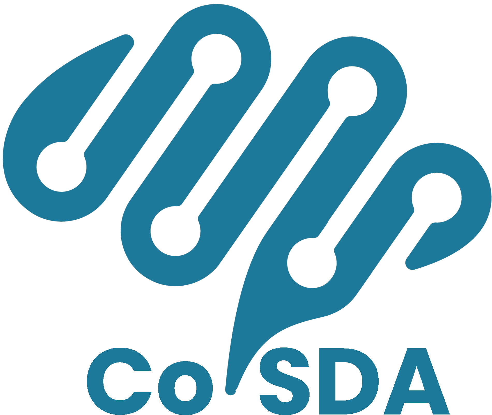
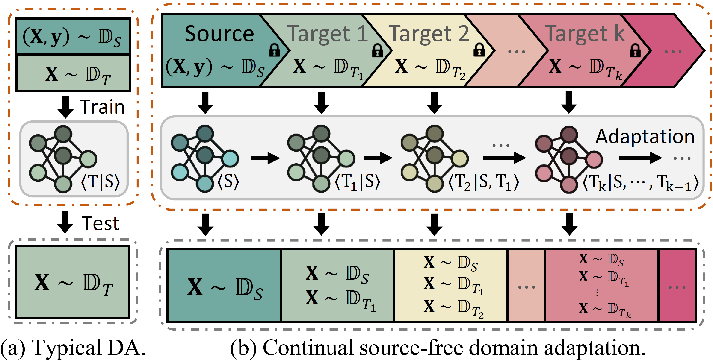
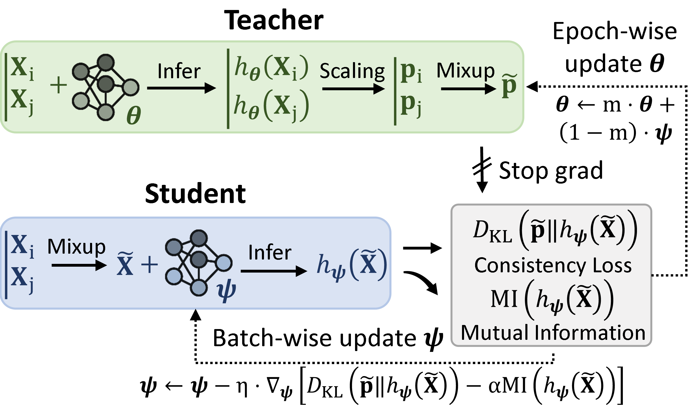

<div align='center' style="margin-bottom: 10px"></div>

# Implementation for CoSDA: Continual Source-Free Domain Adaptation

Here is the code for our work [CoSDA:Continual Source-Free Domain Adaptation](https://arxiv.org/abs/2304.06627). To ensure fair comparison, we build a unified codebase for the methods of source-free domain adaptation and continual DA, as shown in [supported methods](#supported-methods).

- [Introduction](#introduction)
- [Installation and Usage](#installation-and-usage)
  - [Installation of datasets.](#installation-of-datasets)
  - [Source-free domain adaptation](#source-free-domain-adaptation)
- [Supported Methods](#supported-methods)
- [Citation](#citation)


## Introduction
Continual source-free domain adaptation is a new and practical task in the field of domain adaptation, which seeks to preserve the performance of a model across all domains encountered during the adaptation process while also protecting the privacy of private data, as illustrated in the following figure:
<div align='center'></div>

CoSDA is a continual source-free domain adaptation approach that employs a dual-speed optimized teacher-student model pair and is equipped with consistency learning, as shown in the following figure. The implementaion details of CoSDA are shown in \[[train/cosda/cosda.py](train/cosda/cosda.py)\].

<div align='center'></div>

## Installation and Usage

### Installation of datasets.
First, download the datasets from the following links:

  - [DomainNet](http://ai.bu.edu/M3SDA/)
  - OfficeHome: (1) [image_list](https://cloud.tsinghua.edu.cn/f/ca3a3b6a8d554905b4cd/?dl=1) (2) [Art](https://cloud.tsinghua.edu.cn/f/4691878067d04755beab/?dl=1) (3) [Clipart](https://cloud.tsinghua.edu.cn/f/0d41e7da4558408ea5aa/?dl=1) (4) [Product](https://cloud.tsinghua.edu.cn/f/76186deacd7c4fa0a679/?dl=1) (5) [Real_World](https://cloud.tsinghua.edu.cn/f/dee961894cc64b1da1d7/?dl=1)
  - Office31: (1) [image_list](https://cloud.tsinghua.edu.cn/f/d9bca681c71249f19da2/?dl=1) (2) [amazon](https://cloud.tsinghua.edu.cn/f/edc8d1bba1c740dc821c/?dl=1) (3) [dslr](https://cloud.tsinghua.edu.cn/f/ca6df562b7e64850ad7f/?dl=1) (4) [webcam](https://cloud.tsinghua.edu.cn/f/82b24ed2e08f4a3c8888/?dl=1)
  - [VisDA17](https://ai.bu.edu/visda-2017/)

Next, select a `base_path`, create a `dataset` folder within it and place the downloaded files in this folder, as shown below:
```
base_path
├── dataset
    ├── DomainNet
    │   ├── splits
    │   ├── clipart
    │   ├── infograph
    │   ├── painting
    │   ├── quickdraw
    │   ├── real
    │   ├── sketch
    ├── Office31
    │   ├── image_list
    │   ├── amazon
    │   ├── dslr
    │   └── webcam
    ├── OfficeHome
    │   ├── image_list
    │   ├── Art
    │   ├── Clipart
    │   ├── Product
    │   ├── Real_World
    └── Visda2017
        ├── image_list
        ├── train
        └── validation
```
### Source-free domain adaptation
* Dependencies and environment setup.
  ```
  pip install -r requirements.txt
  ```
* Pretrain.
  
  * *To Do*: Our intention is to supply the pretrained parameters for all datasets using the SHOT, SHOT++, and GSFDA methods, thereby eliminating redundant training and reducing computational overhead.
    
    * Download Link (Under Construction): [DomainNet](), [OfficeHome](), [Office31](), [VisDA2017]().

  ```
  python pretrain.py -bp [base_path] --config [config_file] 
  ```
  The `base_path` is the selected location where the dataset will be installed. The `config_file` is stored in the  \[[pretrain/config/backup](pretrain/config/backup)\] directory. We have designed specific configurations for GSFDA, and SHOT++, while for other methods, we use the same pretrain configuration as SHOT method used. 

  Once the pretraining process is complete, the model will be saved within the base_path directory. Below is an example of the resulting file structure for DomainNet:

  ```
  base_path
  ├── DomainNet
      ├── pretrain_parameters_shot
      │   ├── source_{}_backbone_{}.pth.tar
  ```
  
* Single-target adaptation.
  ```bash
  python single_tar.py -bp [base_path] --config [config_file] --writer [tensorboard / wandb]
  ```
  We have created separate configuration files for each method, which can be found in the \[[adaptationcfg/backup)](adaptationcfg/backup)\] directory. The `source_domain` and `target_domain` can be manually specified under the `DAConfig` key in the configuration file. 

  We provide support for two methods of recording the training process: `tensorboard` and `wandb`. To use `tensorboard`, you need to specify the `log_path` to store the event files locally using `-lp [log_path]`. To use `wandb`, you need to specify the `entity` using `-e [entity]`.

* Multi-targets adaptation.

  ```bash
  python multi_tar.py --config [config_file] -bp [base_path] --writer [tensorboard / wandb] (-lp [log_path] or -e [entity])
  ```
  The settings for multi-target domain adaptation are the same as those for single-target adaptation. For DomainNet, the sequential adaptation order is Real → Infograph → Clipart → Painting → Sketch → Quickdraw. For OfficeHome, the sequential adaptation order is Art → Clipart → Product → Real-world.

## Supported Methods
Apart from CoSDA, we also support the following methods. 

- **SHOT** - Do We Really Need to Access the Source Data? Source Hypothesis Transfer for Unsupervised Domain Adaptation. [(ICML'20)](https://proceedings.mlr.press/v119/liang20a.html) \[[train/shot/shot_plus.py](train/shot/shot_plus.py)\]

- **SHOT++** - Source Data-absent Unsupervised Domain Adaptation through Hypothesis Transfer and Labeling Transfer. [(TPAMI)](https://arxiv.org/pdf/2012.07297.pdf) \[[train/shot/shot_plus.py](train/shot/shot_plus.py)\]

- **G-SFDA** - Generalized Source-free Domain Adaptation. [(ICCV'21)](https://openaccess.thecvf.com/content/ICCV2021/html/Yang_Generalized_Source-Free_Domain_Adaptation_ICCV_2021_paper.html) \[[train/gsfda/gsfda.py](train/gsfda/gsfda.py)\]

- **NRC** - Exploiting the Intrinsic Neighborhood Structure for Source-free Domain Adaptation. [(NeurIPS'21)](https://proceedings.neurips.cc/paper/2021/hash/f5deaeeae1538fb6c45901d524ee2f98-Abstract.html) \[[train/nrc/nrc.py](train/nrc/nrc.py)\]

- **AaD** - Attracting and Dispersing: A Simple Approach for Source-free Domain Adaptation. [(NeurIPS'22)](https://openreview.net/forum?id=ZlCpRiZN7n) \[[train/aad/aad.py](train/aad/aad.py)\]

- **DaC** - Divide and Contrast: Source-free Domain Adaptation via Adaptive Contrastive Learning. [(NeurIPS'22)](https://arxiv.org/abs/2211.06612) \[[train/dac/dac.py](train/dac/dac.py)\]

- **Edgemix** - Balancing Discriminability and Transferability for Source-Free Domain Adaptation. [(ICML'22)](https://proceedings.mlr.press/v162/kundu22a.html) \[[train/dataaug/edgemix.py](train/dataaug/edgemix.py)\]

- **CoTTA** - Continual Test-Time Domain Adaptation. [(CVPR'22)](https://openaccess.thecvf.com/content/CVPR2022/html/Wang_Continual_Test-Time_Domain_Adaptation_CVPR_2022_paper.html) \[[train/cotta/cotta.py](train/cotta/cotta.py)\]

## Citation
If you find our paper helpful, consider citing us via:
```
Anonymous
```
