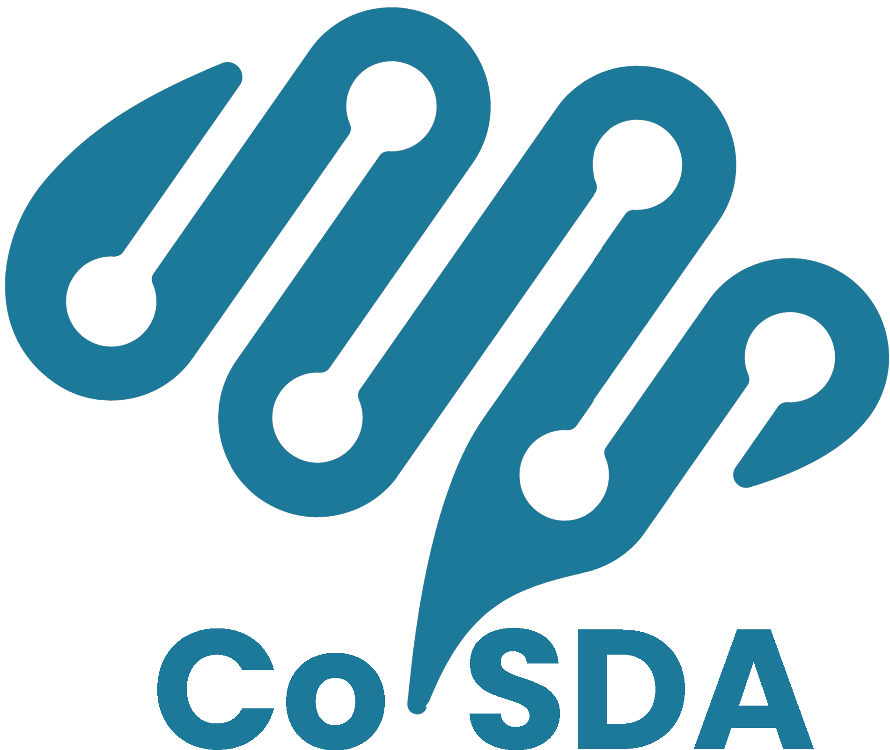

<div align='center' style="margin-bottom: 10px"></div>

# CoSDA的实现


[README](README.md) | [中文文档](README_zh.md)

这里是 [CoSDA:Continual Source-Free Domain Adaptation](https://arxiv.org/abs/2304.06627) 的论文代码。为了确保公平比较，我们复现了[支持的方法](#supported-methods)中的所有方法，并进行了统一的评估和比较。

- [CoSDA的实现](#cosda的实现)
  - [介绍](#介绍)
  - [安装及用法](#安装及用法)
    - [下载数据集](#下载数据集)
    - [无源域适应](#无源域适应)
  - [支持的方法](#支持的方法)
  - [Citation](#citation)


## 介绍
持续无源域适应是我们提出的域适应领域的一个现实意义很强的新任务。该任务要求模型在保护数据隐私的前提下，在适应的同时，保留适应经过的所有域上的表现。下面是该任务的示意图：
<div align='center'></div>

CoSDA 是我们针对上述任务所提出的新方法。该方法使用双速优化的教师-学生模型对，具备持续学习的能力。其训练过程如下图所示，实现细节见 \[[train/cosda/cosda.py](train/cosda/cosda.py)\].

<div align='center'></div>

## 安装及用法

### 下载数据集
首先，从以下链接中下载数据集：

  - [DomainNet](http://ai.bu.edu/M3SDA/)
  - OfficeHome: (1) [image_list](https://cloud.tsinghua.edu.cn/f/ca3a3b6a8d554905b4cd/?dl=1) (2) [Art](https://cloud.tsinghua.edu.cn/f/4691878067d04755beab/?dl=1) (3) [Clipart](https://cloud.tsinghua.edu.cn/f/0d41e7da4558408ea5aa/?dl=1) (4) [Product](https://cloud.tsinghua.edu.cn/f/76186deacd7c4fa0a679/?dl=1) (5) [Real_World](https://cloud.tsinghua.edu.cn/f/dee961894cc64b1da1d7/?dl=1)
  - Office31: (1) [image_list](https://cloud.tsinghua.edu.cn/f/d9bca681c71249f19da2/?dl=1) (2) [amazon](https://cloud.tsinghua.edu.cn/f/edc8d1bba1c740dc821c/?dl=1) (3) [dslr](https://cloud.tsinghua.edu.cn/f/ca6df562b7e64850ad7f/?dl=1) (4) [webcam](https://cloud.tsinghua.edu.cn/f/82b24ed2e08f4a3c8888/?dl=1)
  - [VisDA17](https://ai.bu.edu/visda-2017/)

接着，选择一个路径作为`base_path`，在其中创建 `dataset` 目录，并把下载的数据集放在这个目录。下面是预期的目录树：
```
base_path
├── dataset
    ├── DomainNet
    │   ├── splits
    │   ├── clipart
    │   ├── infograph
    │   ├── painting
    │   ├── quickdraw
    │   ├── real
    │   ├── sketch
    ├── Office31
    │   ├── image_list
    │   ├── amazon
    │   ├── dslr
    │   └── webcam
    ├── OfficeHome
    │   ├── image_list
    │   ├── Art
    │   ├── Clipart
    │   ├── Product
    │   ├── Real_World
    └── Visda2017
        ├── image_list
        ├── train
        └── validation
```
### 无源域适应
* 安装依赖和创建环境
  ```
  pip install -r requirements.txt
  ```
* 预训练
  
  ```
  python pretrain.py -bp [base_path] --config [config_file] 
  ```
  其中，`base_path` 是数据集所在目录。`config_file` 是适应所用的配置文件，存放在 \[[pretrain/config/backup](pretrain/config/backup)\] 目录下。GSFDA和SHOT++有特殊的预训练策略，其余方法均使用与SHOT相同的预训练策略。

  预训练结束后，源模型参数将存放在 `base_path` 下。下面的示例展示了在DomainNet数据集上预训练后的目录树：

  ```
  base_path
  ├── DomainNet
      ├── pretrain_parameters_shot
      │   ├── source_{}_backbone_{}.pth.tar
  ```
  * 你也可以直接使用我们训练好的源模型参数。下面的链接中是SHOT、SHOT++和GSFDA策略的源模型参数，根据训练的数据集分类：[DomainNet](https://drive.google.com/file/d/1fyQuNXtME9Uf_oHHrw9ZCHZL7-TyGJzo/view?usp=sharing), [OfficeHome](https://drive.google.com/file/d/18OpU8AX3i8_GUey3SeMyMVG_EkP6Rm-y/view?usp=sharing), [Office31](https://drive.google.com/file/d/1TU_G1P8EveiYAT5vW-eGIhijqxs-kO0I/view?usp=share_link), [VisDA2017](https://drive.google.com/file/d/1BnqOTSeJ1Nuza0WW1uTvPnLJCznJRCaq/view?usp=sharing).

* 单目标域适应
  ```bash
  python single_tar.py -bp [base_path] --config [config_file] --writer [tensorboard / wandb]
  ```
  每种方法在每个数据集上有各自的配置文件。其所在的路径为 \[[adaptationcfg/backup)](adaptationcfg/backup)\] 。源域  `source_domain` 和目标域 `target_domain` 及方法 `method` 在配置文件的 `DAConfig` 中指定。

  日志方面，我们提供了两个选项：`tensorboard` 和 `wandb` 若使用 `tensorboard` 记录训练过程，需要通过命令行参数 `-lp [log_path]` 指定本地日志路径。若使用 `wandb` ，需要由 `-e [entity]`指定`entity`。

* 多目标域次序适应
  ```bash
  python multi_tar.py --config [config_file] -bp [base_path] --writer [tensorboard / wandb] (-lp [log_path] or -e [entity])
  ```
  命令行参数与单目标域适应相同。对于DomainNet数据集，适应的顺序为：Real → Infograph → Clipart → Painting → Sketch → Quickdraw. 对于 OfficeHome 数据集，适应顺序为Art → Clipart → Product → Real-world.

## 支持的方法
除了我们的CoSDA以外，还支持以下方法的评估

- **SHOT** - Do We Really Need to Access the Source Data? Source Hypothesis Transfer for Unsupervised Domain Adaptation. [(ICML'20)](https://proceedings.mlr.press/v119/liang20a.html) \[[train/shot/shot_plus.py](train/shot/shot_plus.py)\]

- **SHOT++** - Source Data-absent Unsupervised Domain Adaptation through Hypothesis Transfer and Labeling Transfer. [(TPAMI)](https://arxiv.org/pdf/2012.07297.pdf) \[[train/shot/shot_plus.py](train/shot/shot_plus.py)\]

- **G-SFDA** - Generalized Source-free Domain Adaptation. [(ICCV'21)](https://openaccess.thecvf.com/content/ICCV2021/html/Yang_Generalized_Source-Free_Domain_Adaptation_ICCV_2021_paper.html) \[[train/gsfda/gsfda.py](train/gsfda/gsfda.py)\]

- **NRC** - Exploiting the Intrinsic Neighborhood Structure for Source-free Domain Adaptation. [(NeurIPS'21)](https://proceedings.neurips.cc/paper/2021/hash/f5deaeeae1538fb6c45901d524ee2f98-Abstract.html) \[[train/nrc/nrc.py](train/nrc/nrc.py)\]

- **AaD** - Attracting and Dispersing: A Simple Approach for Source-free Domain Adaptation. [(NeurIPS'22)](https://openreview.net/forum?id=ZlCpRiZN7n) \[[train/aad/aad.py](train/aad/aad.py)\]

- **DaC** - Divide and Contrast: Source-free Domain Adaptation via Adaptive Contrastive Learning. [(NeurIPS'22)](https://arxiv.org/abs/2211.06612) \[[train/dac/dac.py](train/dac/dac.py)\]

- **Edgemix** - Balancing Discriminability and Transferability for Source-Free Domain Adaptation. [(ICML'22)](https://proceedings.mlr.press/v162/kundu22a.html) \[[train/dataaug/edgemix.py](train/dataaug/edgemix.py)\]

- **CoTTA** - Continual Test-Time Domain Adaptation. [(CVPR'22)](https://openaccess.thecvf.com/content/CVPR2022/html/Wang_Continual_Test-Time_Domain_Adaptation_CVPR_2022_paper.html) \[[train/cotta/cotta.py](train/cotta/cotta.py)\]

## Citation
我们的工作引用格式如下：
```
@article{feng2023cosda,
  title={CoSDA: Continual Source-Free Domain Adaptation},
  author={Feng, Haozhe and Yang, Zhaorui and Chen, Hesun and Pang, Tianyu and Du, Chao and Zhu, Minfeng and Chen, Wei and Yan, Shuicheng},
  journal={arXiv preprint arXiv:2304.06627},
  year={2023}
}
```
